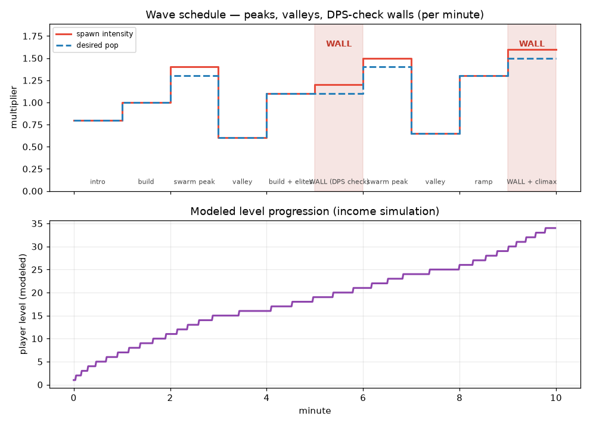

# Balance Overhaul Plan — XP Curve, Time Waves, Gem Ceiling

Status: **PLAN — awaiting approval before implementation.**
Scope: four interlocking systems requested for the survivors-style economy/pacing.

## Locked decisions
- **Run length:** keep 10-minute runs (`WIN_TIME = 600`). The 20–30 min spec
  (walls at min 14/29, level 60–70) is compressed to this length.
- **Difficulty model:** keep the existing adaptive **heat** and layer it *under*
  the scripted waves — waves set the per-minute baseline; heat still nudges spawn
  rate and enemy tier so skilled players get pushed.
- **Targets (10-min, 1.0× XP rate):** ~level **40–50** at the win; standard mobs
  die in 1–2 hits; elites survive 10–20 s.

---

## 1. Predictable XP curve (replaces the linear `_xp_needed`)

Today: `_xp_needed = round((6 + (level-1)*4) / cfg_xp_rate)` — flat linear.

New: three-band piecewise step curve (cost **at** level `L` to reach `L+1`):

| Band  | Levels | Step / level | Feel |
|-------|--------|--------------|------|
| Early | 1–13   | +3           | fast dopamine, lock in core build |
| Mid   | 14–33  | +9           | steepen — tug-of-war until weapons evolve |
| Late  | 34+    | +18          | aggressive — late upgrades feel earned |

Closed form (no loop), still divided by `cfg_xp_rate`. Consts go in `GameConfig`
(`XP_BASE=5`, `XP_STEP_EARLY/MID/LATE`, `XP_BAND_EARLY=13`, `XP_BAND_MID=33`);
`_xp_needed()` becomes a thin wrapper. Network sync (`net_xp_needed`) unchanged.

**Paper-check (advisor) — income simulation, not yet a live measurement:**

| Income assumption | Modeled level @ 10:00 |
|-------------------|-----------------------|
| Conservative (bare spawn interval) | ~27 |
| Realistic (×1.8 for refill + periodic spawns) | ~34 |
| Aggressive (×2.5, refill near-always on) | ~45 |

The dominant unknown is the effective spawn-rate multiplier (`SPAWN_REFILL_MULT`
makes the rate ~2.5× whenever the field is below target — common). **Final band
steps will be calibrated to the *measured* income from a headless fast-forward
run during implementation** to center the realistic case on ~45. Numbers above
are *designed-for*, not verified.

---

## 2. Time-based waves (layered onto `_run_spawning`)

A per-minute `WAVES` table (10 entries) drives composition and intensity on a
clean 1-minute cadence, with peaks/valleys and two DPS-check walls.

| Min | Phase | Intensity | Desired-pop | Wall |
|----:|-------|----------:|------------:|:----:|
| 0 | intro | 0.8 | 0.8 | |
| 1 | build | 1.0 | 1.0 | |
| 2 | swarm peak | 1.4 | 1.3 | |
| 3 | valley (breather) | 0.6 | 0.6 | |
| 4 | build + elites | 1.1 | 1.1 | |
| 5 | **WALL** | 1.2 | 1.1 | ● |
| 6 | swarm peak | 1.5 | 1.4 | |
| 7 | valley (breather) | 0.65 | 0.65 | |
| 8 | ramp | 1.3 | 1.3 | |
| 9 | **WALL + climax** | 1.6 | 1.5 | ● |

Integration:
- `_run_spawning` reads the current minute's `intensity` → divides the spawn
  interval, and its `pop_mult` → scales `_desired_pop`. **Valleys lower
  `_desired_pop` too** (advisor #3) so the refill logic doesn't instantly cancel
  the breather.
- Existing progressive pool unlocks (rushers @45 s, wardens @120 s, …) are kept.
- Heat stays as a multiplier on top (per the locked decision).
- **Walls** fire once per wall-minute via a new `_run_waves(delta)` and a
  dedicated `_spawn_wall()` that places a *tight cluster* at one bearing far from
  players — **not** routed through the new `_enemy_spawn_pos()` safe-radius helper
  (that helper deliberately scatters and would break the formation; advisor #4).
  Walls spawn high-HP enemies (tank/warden tier) to test player DPS.

---

## 3. XP-gem ceiling + red-gem condensation (perf-critical)

Directly addresses the late-game frame collapse: unbounded ground gems are
`_process`-d, drawn, and network-synced every frame.

- `MAX_GEMS = 500` active ground gems (`GameConfig`).
- In `_on_enemy_killed`, before spawning a gem: if `gems_by_id.size() >= MAX_GEMS`,
  **don't spawn** — instead funnel the XP value into the gem **farthest from its
  nearest player**, bumping its `value` (a `_condense_gem(value)` helper).
- The condensed gem renders **red and larger**, scaled by value. Threshold to go
  red is **≥ 25** — well above any single-enemy drop (tanks give xp 5), so normal
  tank gems don't false-read as condensed (advisor #5).
- **No new network field**: gem `value` is already in the `STATE_GEMS` packet, so
  clients derive the red color from value automatically.

---

## 4. Mathematical benchmarks (acceptance criteria + doc)

Tracked during calibration, recorded in this folder:

| Metric | Target | Knob if off |
|--------|--------|-------------|
| TTK — trash | 1–2 hits | `EnemyConfig` `hp0`/`hpk`, `_make_enemy` scaling |
| TTK — elite | 10–20 s | elite tier hp, `_diff()` scaling |
| Level @ 10:00 | ~40–50 | XP band steps |
| Stat inflation vs enemy HP | player max DPS ≥ enemy HP growth | `hpk` vs weapon growth |

A short calibration table (measured vs target) will be appended after the
fast-forward run.

---

## Verification strategy (before any "verified" claim)

The blocker the advisor flagged: `--quit-after` counts **frames**, not seconds —
a 600-frame run is ~10 s of game time and exercises **none** of these late-game
systems. Plan:

1. **Add a fast-forward test hook** — `NICESWARM_FF=<mult>` scales the host
   sim clock so a headless run reaches minute 10 in seconds. Print level at each
   minute mark and the final gem count.
2. **Force the gem cap** in a test path (or just let FF accumulate) to confirm
   condensation + red gems fire.
3. **Calibrate** XP band steps to the measured per-minute levels → hit ~45.
4. Re-run solo + zoo smoke tests for regressions; co-op smoke test for sync of
   condensed-gem value.
5. Report measured numbers as **verified**; anything only modeled as
   **designed-for, pending playtest**.

---

## Commit / PR structure

Per-system commits so a curve-calibration miss can't hold the perf win hostage
(advisor #6):

1. `perf: cap ground XP gems at 500 with red-gem condensation` ← independent, ships the lag fix
2. `feat: three-band XP curve (early/mid/late)`
3. `feat: time-based wave schedule with peaks, valleys, and DPS-check walls`
4. `test: NICESWARM_FF fast-forward hook + calibration notes`

All on branch `balance/curve-waves`, opened as a single PR (this plan is the
first commit; implementation follows after approval).
